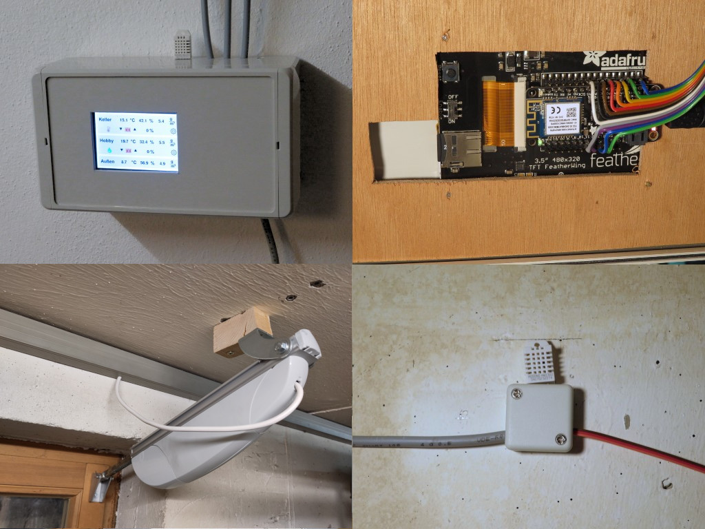

# Basement Ventilation

You know this situation: the air in the basement rooms is always too wet. The most simple way to change that is ventilation. Ventilation at the right time.

It only makes sense to open the windows when the air outside is drier than inside. If it is the other way around then you should better keep them shut. You can do that manually, of course. But especially in summer the right time is in very early hours, and who wants to get up at 3:00 just to open the window in the basement?

This Arduino project does this automatically for two rooms in my house. Its basic setup is a simple 1-2-3:

* 1 Adafruit Feather board and a touch display
* 2 linear motors to operate the windows
* 3 sensors to measure temperature and humidity outside and in the two rooms

The rest is some software.

I'm trying to give you enough information to build this project for your house. You might modify it to cope with more or less rooms or add your own features.

If you have any questions, ideas, improvements or find an error, don't hesitate to create an [issue](/issues). I don't promise to answer, but I will try!

## Features

Feature #1 for me was: **This project is cloudless!** Today, not even a coffee machine is working without an online connection anymore. Every cup of coffee is first reported to the manufacturer, before it is delivered to you. This project is different. You do not have to send your data to some outside server. And even if it has WiFi on board: No bit of data ever leaves your house, if you don't want.

And here's the list of what this project **can** do, even offline :) Just opening and closing the windows was not enough for me. The more you think about it, the more features come on the list. Currently the project includes:

* Reading the sensors and computing the absolute humidity inside and outside
* Controlling the window position exactly: not only fully open and fully closed is possible, but every position in between
* Making the decision when to open or close a window
* Displaying all measurement values and the decisions made on a nice screen
* Manually operating the windows from the touch display
* Storing the measurement data on a SD card with timestamp for later evaluation
* Making the measurement data remotely accessible as CSV file
* Providing a simple web interface displaying the same information as the local screen
* Sending log information to your computer so that you can follow program execution online

That's a lot of stuff for such a simple task, isn't it? And you (and me!) probably have more ideas.

## Why choose my project?

My project is definitely not the only possibility to keep your basement dry. Why chose my project? Here are some roughly comparable projects!

1. [Humidity controlled cellar ventilation](https://www.raspberrypi.org/forums/viewtopic.php?t=152917)
2. [Dew point ventilation controller](http://danifold.net/fancontrol.html)
3. [ArDewpoint Dew Point Based Ventilation Controller](http://www.instructables.com/id/ArDewpoint-Dew-Point-Based-Ventilation-Controller/)
4. [Automation of ventilation system](https://create.arduino.cc/projecthub/team-iminds-iot/automation-of-ventilation-system-1913a5)

Number 2 on the list is a very perfectionist implementation of an automatic ventilation system! If I had seen the window motors used in this project before, I might have used them - even if they cost three to four times as much as my actuators. But besides that, what my project differentiates from all of the above is the following:

* I'm **not using a fan** for ventilation, but only open and close the windows. Until now I can see that this is completely sufficient, even if the windows are below surface. Adding a fan would mean that I would have to drill some hole to the outside, which I definitely wanted to avoid. Only project 2 has also the option to operate the windows.
* My project can control **two rooms independently**. One is our food store, and I want to keep it quite cold there. The other is my workshop, and also the heating and the washing machine are located there. Here I want it definitely warmer. I keep the doors to these two rooms closed, so that the cold air from the food store stays there and does not cool down the complete house. None of the project is controlling two rooms independently.
* Project 4 is working with the SmartLiving.io Internet of Things platform. I know, all that stuff is cool, but do I really need this? The other projects - and of course also mine - can also **work offline**.
* I'm trying to **keep things simple** - and still smart. Icinga based monitoring using Nagios plugins (see project 1) might be a cool feature for somebody close to a system administrator, but might be too complicated for the average hobbyist. 
* I wanted to have simple **local operation using a touch screen**. Project 1 has this also, the others don't.

So you see, besides some similarities, there are still differences - and that's what caused me to start my own project.

## BOM (Bill of material)

For that project I used the following parts:

* [Adafruit Feather M0 WiFi](https://www.adafruit.com/product/3010)
* [Adafruit TFT FeatherWing - 3.5" 480x320 Touchscreen for Feathers](https://www.adafruit.com/product/3651)
* [5V 4 Channel Relay Shield](https://www.exp-tech.de/module/relais/4262/5v-4-channel-relay-shield?c=1048)
* [DHT22 temperature-humidity sensor](https://www.exp-tech.de/sensoren/temperatur/5604/dht22-temperature-humidity-sensor-extras)
* [DARL 3610 actuator](http://www.summit-media.de/shop/Aktuatoren-Positioner/Aktuator-Superjack-DARL-3610.html)
* [Mounting brackets](https://www.amazon.de/MagiDeal-St%C3%BCck-Hochleistungs-Montageb%C3%BCgel-Halterung-Linearantrieb/dp/B072F7M92G)
* [36V power supply for actuators](https://www.voelkner.de/products/902705/Mean-Well-AC-DC-Netzteilbaustein-geschlossen-LRS-75-36-36-V-DC-2.1-A-75.6-W.html)
* a simple USB power supply for the Adafruit parts
* some electronic parts (resistors, capacitors) mentioned in the text
* cable, housing, etc as you need and like

It finally cost me about 200 € and gave me a lot of fun -- and dry air in the basement rooms!

## Step by step

I will not provide a fool-proof step by step instruction for building that project, but rather assume that you have some level of experience. Decide yourself whether you're ready to make it! However I will go more into details of the pitfalls I've already stumbled upon.

* [Me and the mechanics - How to open and close the windows](doc/motors.md)
* [Spikes that hurt - How to dejam the DC motors](doc/spikes.md)
* [Wet wet wet - What is relative and absolute humidity and when shall I open the windows](doc/humidity.md)
* [All you need - Installing the necessary libraries](doc/libraries.md)
* [Touch me - What your spouse, friend, or whoever sees](doc/user.md)
* [Get on the SPI bus - headaches because of an SD card](doc/spi.md)
* [Code walk - Explaining architecture and details of the program](doc/code.md)
