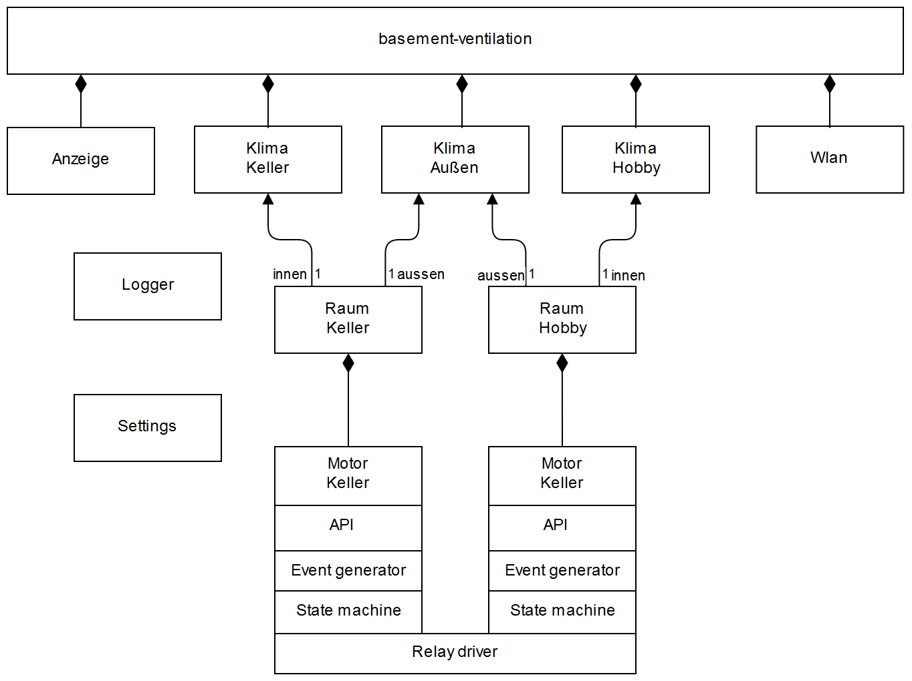
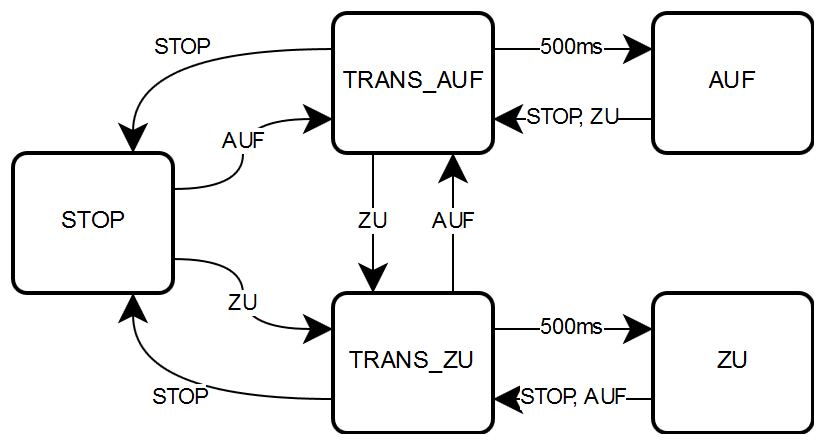

# Code walk - Explaining architecture and details of the program

At the latest when looking into the code you easily find out that I'm from Germany. There are some German class names and comments, but I think the structure of the program is clear enough that this is not a problem. Additionally I will explain some points to you here on this page. The following diagram first gives you an overview of the objects and their relationship:

## basement-ventilation.ino

As for every sketch the main routines are located in the [basement-ventilation.ino](../basement-ventilation/basement-ventilation.ino) source file. Here is the `setup` and the `loop` function located.

At the very beginning we `#include "pins.h"` and that is also the place where to look when you wonder which pin of the Feather is connected to what.

I then created a set of classes which wrap functionality:

* `Klima` is for sensor reading and computation of the absolute humidity
* `Raum` represents a room and makes the proper decisions for the window
* `Motor` controls the motors of the actuators and the window position
* `Anzeige` is responsible for the display and the touch screen
* `Wlan` provides WiFi connectivity and contains an NTP client and a simple web server
* `Log` provides logging capabilities to the serial console and via UDP to a remote computer
* `Settings` manages persistent configuration values

In the beginning I set up a set of related objects:

* first the `Klima` objects are created for the three sensors
* Then two `Raum` objects are created, each referring to two sensors, the specific one inside and the common one outside
* Also the objects `Anzeige` and `Wlan` are created here.

Then the pins are configured and the `setup` function of these classes is called. What they exactly do is detailed in the description of these classes. Finally a first NTP request is sent to get the actual date and time.

The `loop` function is based on the paradigm that it is the responsibility of each class to find out whether there is something to do at the moment or not. The `update` methods of each object is called. Some of them return a bool indicating whether they changed anything or not. When a change has occurred, the result is probably shown on the display. No object should block longer than absolutely necessary during the `update` call. If necessary, tasks should be split into pieces, as the `Wlan.serve()` method does.

The only longer piece of code is the handling of touch events. If such an event is detected, then a `switch` statement is used to perform the proper task. Most tasks are just two or three lines long, so this is still a reasonable approach.

## Klima

The longest individual task is reading a DHT22 sensor, which takes about 300ms. Also the sensors should not be read more often than every 2 seconds. For things which change slowly as temperature and humidity this still much too fast.

I decided to read each sensor every 30 seconds and to distribute the reading of the three sensors over a 30 second interval:

* the first sensor is read at second 0 and 30
* the second sensor is read at second 10 and 40
* the third sensor is read at second 20 and 50

This pattern is defined during setup. Each `Klima` object keeps track of the next time a sensor reading is necessary. If `update` is invoked before this time, it returns immediately. At the proper time, it reads new sensor values and computes the absolute humidity from the temperature and relative humidity. The change of values is indicated by returning `true`.

## Raum

Here you will find the decision logic which determines the desired window position. It takes into account the following values:

* absolute humidity
* temperature
* whether the pellet heating located in one of my rooms is on

For absolute humidity there are configurable values in the Settings used to determine the maximum humidity difference allowed before the windows are opened and the minimum difference when they will be closed again. This gives you some control over the hysteresis of the controller which affects the frequency of opening and closing the window.

The temperature is a minimum value which shall not be undercut. In one of the rooms there is my hobby workshop and I do not want to have it too cold there.

The third argument is the pellet heating of my house. The fire uses air from the room, and it is desirable that the window is open at least a little bit while the fire is burning. So I installed a sensor there connected to an input pin of my Feather which indicates this situation. If you leave this pin open it simply has no effect.

## Motor

This class controls the relays for the motors. This is not as easy as it might sound. Take again a look at the object overview at the top of this page. This class is divided into three layers responsible for three aspects of motor control:

* First the API layer implemented in `moveto()`. It is the one method called by the Raum class to tell the motor that it should move the window to that position expressed as percentage between 0 and 100.
* Second the event generator implemented in `update()`, which simply compares the target position to the current position and decides in which direction the motor has to move or whether position is close enough to the target position to leave it unchanged.
* Third the motor state machine implemented in `move()` which evaluates the events and executes the following state machine:

Remember the discussion about the [motors](motors.md) and relays: to operate a motor, we first have to select the motor and direction and then switch on the power. In the opposote direction, we first have to switch off the power and can then change direction and motor selection or just switch everything off. This is reflected by this state machine and the intermediate states TRANS_AUF and TRANS_ZU.