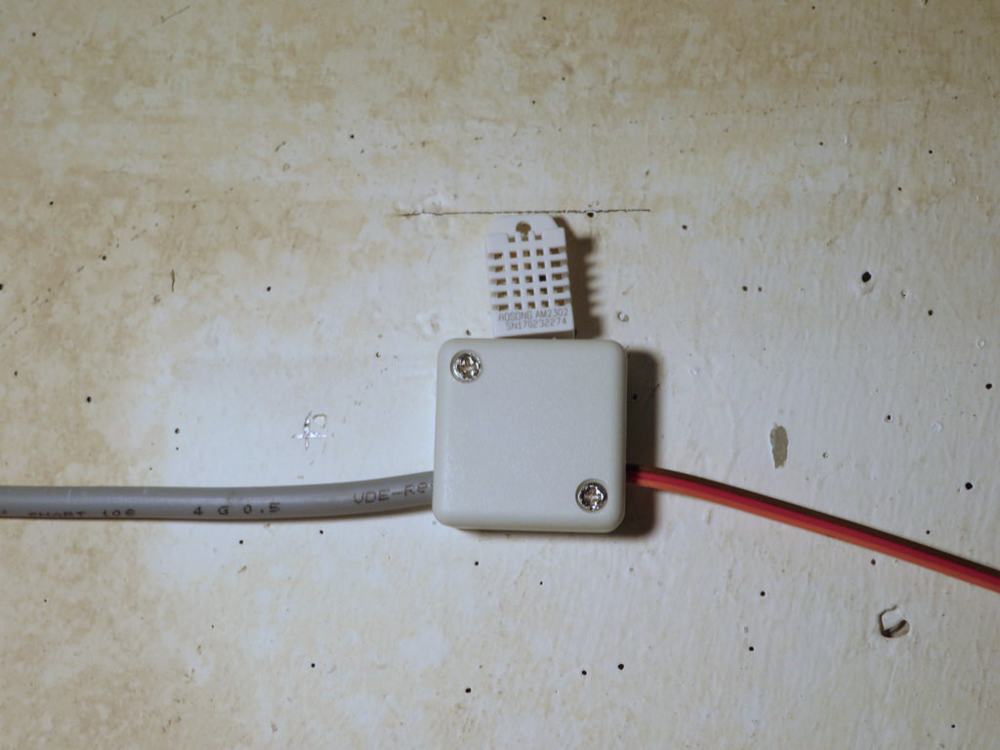

# Wet wet wet - What is relative and absolute humidity and when shall I open the windows

I don't start to explain relative and absolute humidity here. Just take a look at [Wikipedia - Humidity](https://en.wikipedia.org/wiki/Humidity). The first few sentences are enough to understand the following.

To find out whether opening the window will help to lower the humidity in a room, you have to compare the **absolute** humidity inside and outside: How many grams of water are in one cubic meter of air inside and outside? When air is exchanged, also this amount of water is exchanged.

It might be that the **relative** humidity outside is higher than inside. But if the outside temperature is remarkably lower than inside, then the **absolute** humidity of the outside air is lower than inside - and ventilation is helpful. When it is very warm, then the opposite will occur and already a relatively low **relative** humidity will bring in more water to the inside.

Typical sensors as the DHT22 I'm using provide values for temperature and relative humidity. So before making any decisions we first have to calculate the absolute humidity. If you look into the literature then you soon get deeply into physics and terms like vapor pressure and saturation pressure. But luckily there are some formulas in the DIN 4108 standards document and I just assumed that they were correct.

I mounted one of the sensors directly on to of the housing as you can see on the image below. 

The sensor in the other room was mounted on the wall, about 1m away from the window used for ventilation. 

The outside sensor was mounted just outside of that window, where it is still protected from rain, snow and wind. Initially I had some doubts whether this is the right position in a light well, where it is considerably warmer and probably more humid than outside. But first experiences told me that this is not a problem. Indeed, when opening the window, exactly this air with that climate will come in. So just outside the window is actually the right mounting position for that sensor.

