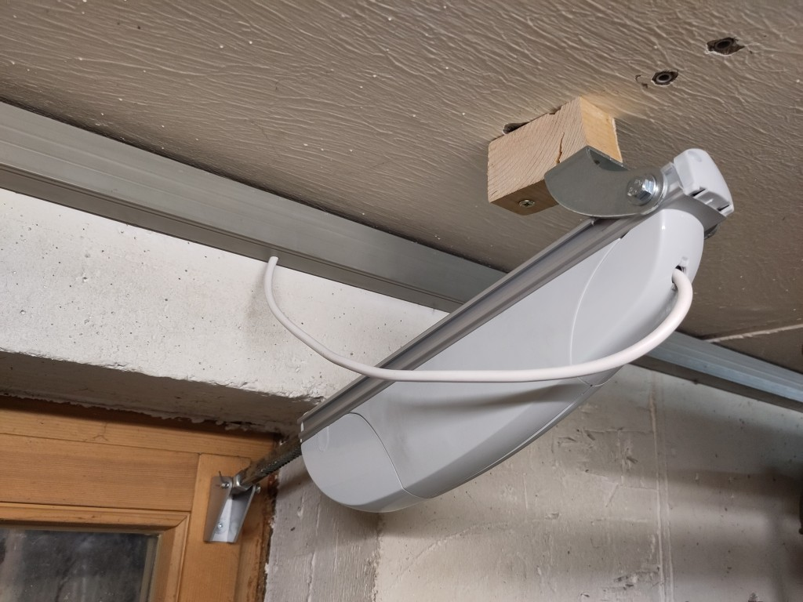

# Me and the mechanics - How to open and close the windows

Something I've been flirting with for the longest time was the question of how to open and close the windows automatically. In one room I have just a small tilt window, the other has a little bit larger one which can be tilted, but also opened normally. I finally came to the conclusion that tilting is easier, and that it can be performed by a linear actuator fixed at the ceiling and the window.

The linear actuators from by [BOM](/README.md#bom-bill-of-material) is a reasonably priced model, which can expand by 16cm. There are also smaller and larger variants, if you need. on One end is an eyelet, on the other an adjustable clip, also with a fixing hole. To fix the actuator to the ceiling and the window I was looking for some mounting brackets. The one I found are quite stable, and also not so expensive. However after ordering I found out that they have a four week delivery time. The reason is, that they are shipped from China, by air mail, but the complete shipping process really needs some time. You might easily find a solution with shorter delivery times, but finally they arrived and they met my expectations.

I had to use a wooden block to widen the distance of the actuator to the ceiling. Otherwise the actuator would hit the ceiling when it is in its most contracted position and the window is open. I was just using longer screws to fasten the bracket to the ceiling together with the wooden block.

When looking at my photos you can easily find out why my project is more suited for the basement and not for the living room. At least I would not have been allowed to install this in the upper floors.

The actuators have mechanical limit switches which can be adjusted. I just set the end positions so that the window is fully open or completely closed, and that the window cannot be accidentally damaged. The shortest position is fixed, but the longest can be adjusted. So I first put the actuator to the shortest position, opened the window and determined the mounting location on the ceiling. Then I expanded the actuator and watched the position closely until the window was closed tightly. Then I set the limit switch so that it switches off in this position.

The actuator is equipped with a DC motor and the direction can be changed by switching the polarity of the voltage. To operate two windows I designed the following relay circuit using four relays to operate two motors.

[Schematic of the relays](relay-schematic.png)

K1 and K2 are used to switch the polarity of the voltage. When K1 is on and K2 is off, the lower terminal of the motor will get +36V and the upper terminal will be connected to ground. Vice versa, when K1 is off and K2 is on, the polarity is reversed.

K3 is used to select one of the motors. Only one of the actuators can be operated at a time, but that is sufficient and reduces the number of relays needed and the maximum power of the power supply.

But why did I add K4? It is used to switch power on or off from the complete circuit. But isn't power off anyway when both K1 and K2 are switched off? The answer is yes and no. Without K4 the power supply will be directly connected to the two terminals of the change-over switch. However you have no guarantee that one contact will be disconnected cleanly before the other contact is closed during the switching process. A short circuit may occur during switching and indeed something like this actually happened to me.

R1 is used to measure the current to the actuators. Originally I have connected the upper terminal of R1 directly to an analog input of the Adafruit Feather to find out, when the actuator is at its end position and the current drops to zero. Originally I made a direct connection. Then during a switching process such a short circuit occured, a high current flowed through R1 causing a high voltage, which killed my Feather immediately. That's how I learned my lesson. Then I added the 10kOhm resistor and 100nF Capacitor as a filter and added relay K4, just to be on the safe side.

