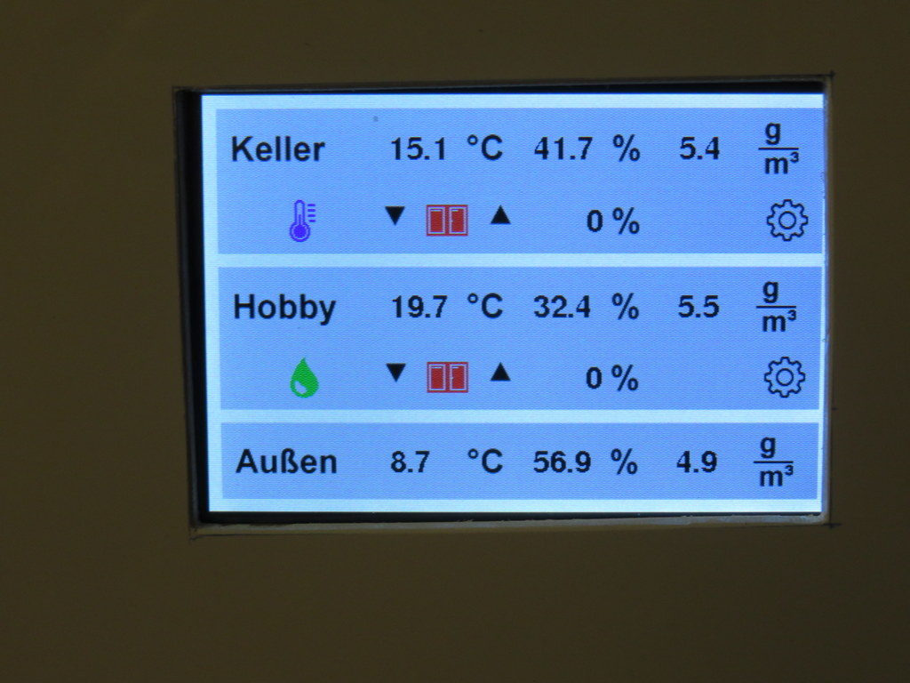

# Touch me - What your spouse, friend, or whoever sees

This is how the typical screen of the basement ventilation looks like:

It shows you the measurement values of the two rooms and the outside sensor. To the right there is also the computed value of the absolute humidity.

In the second row there is first an icon representing the reason of the current window position. You see a thermometer in the "Keller" which tells you that the window is closed, because otherwise the temperature in the room would go below a configured limit. the "Hobby" room shows a green waterdrop which means, that here the window is closed because the humidity inside is ok and ventilation would not bring it further down.

Then there is an icon for an open or closed window, and after that the window position in percent. Both windows are closed, so you see 0% for both of them.

To the right and to the left of the window icon there are two triangles pointing up and down. They can be used to operate the windows manually. When you press them, the motor starts. It stops again when you press the window icon. Making any manual movement takes the controller from the automatic mode to a manual mode. To go back to automatic, you press the hand icon which appears in manual mode where you now see the thermometer and the drop.

Pressing the settings icon brings you to a page where you can adjust the thresholds for opening and closing the window, the lower temperature limit of a room, and the position a window will take when the heating in that room is on. But that's something you should probably not explain to everybody playing around with the controller in your house ;-)
